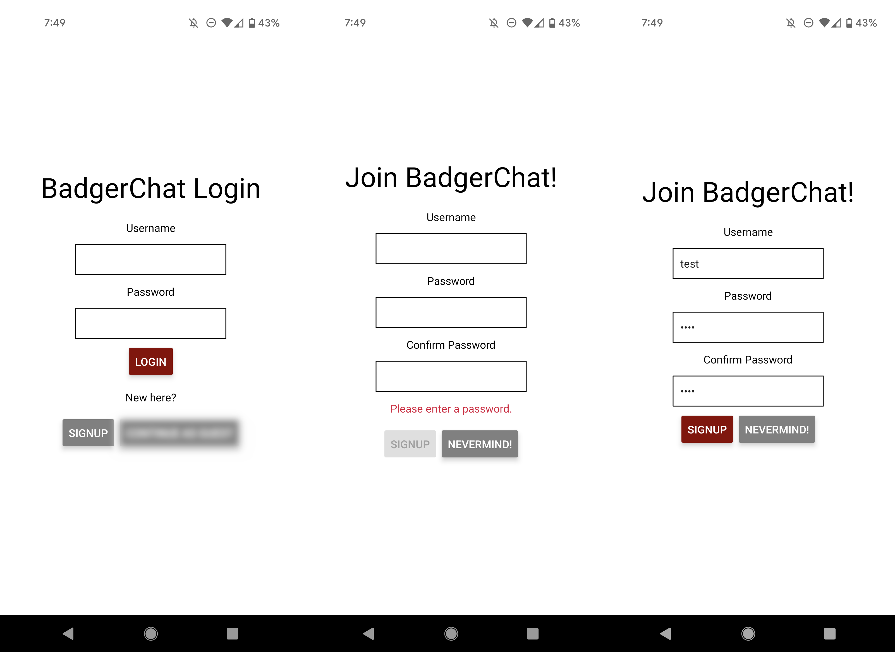
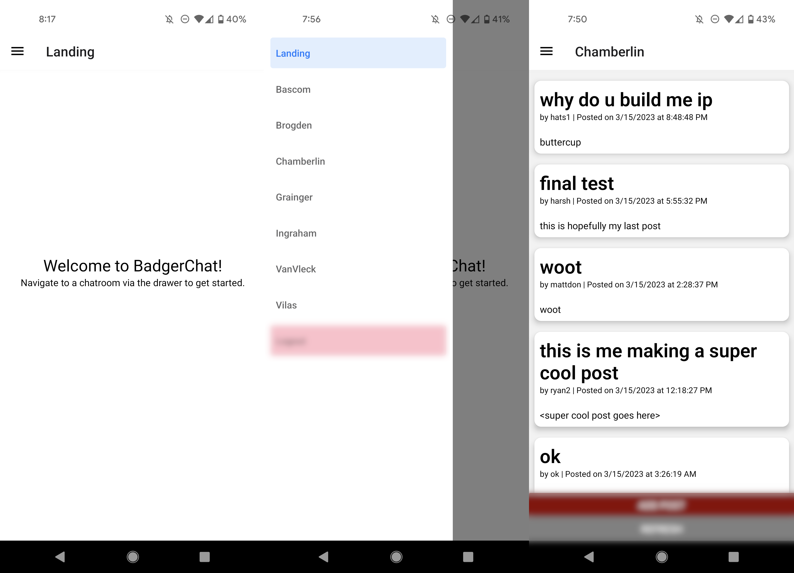
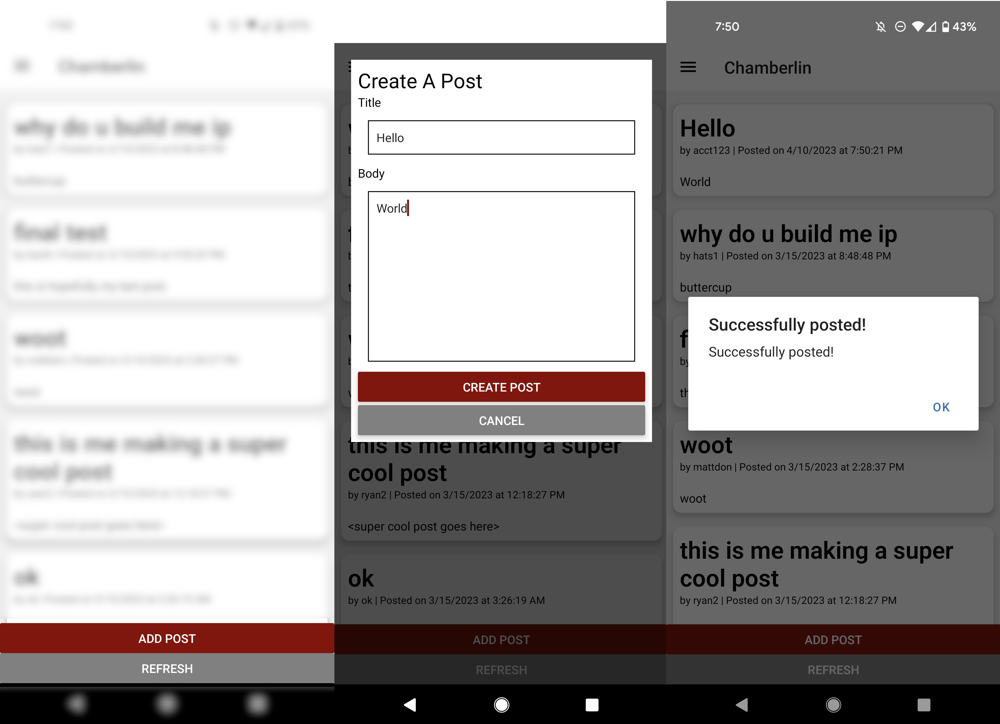
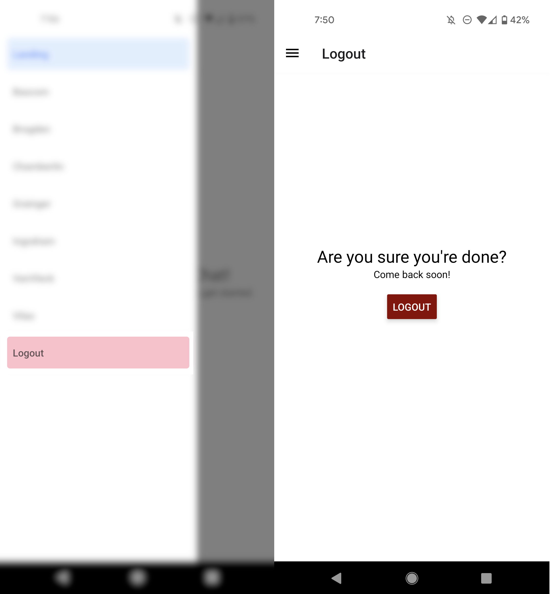
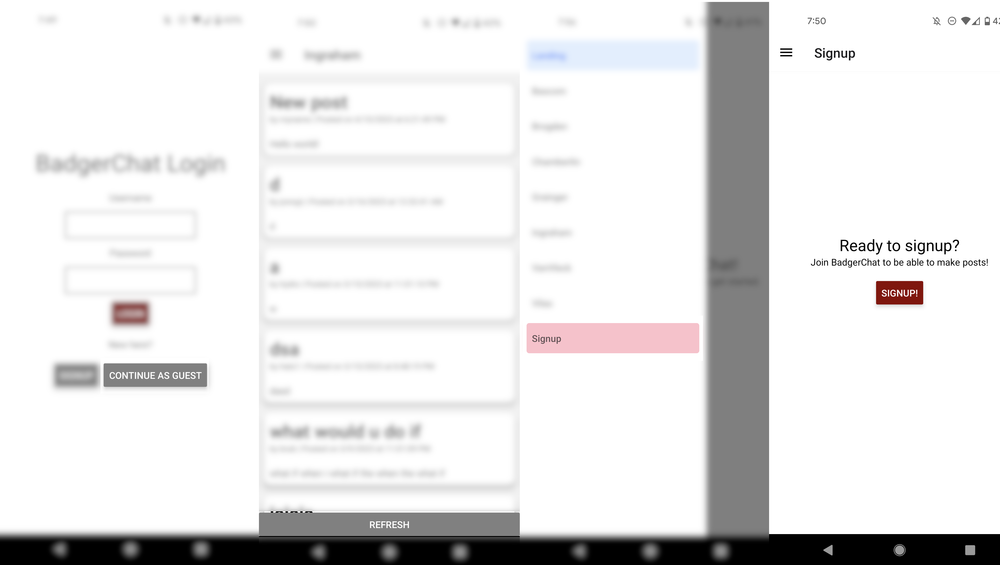

# BadgerChat

BadgerChat is a mobile application where you can view and share your posts in different chatrooms.

## Getting Started

[Expo](https://expo.dev/) and all the necessary libraries for [react navigation](https://reactnavigation.org/) and [expo-secure-store](https://www.npmjs.com/package/expo-secure-store) have already been added. See the `package.json` for details. You do *not* need to re-run the expo init command. Instead, in this directory, simply run...

```bash
npm install
npm start
```

To test your app, you have a few options. If you have a smart device, I would recommend using the expo app for [iOS](https://apps.apple.com/us/app/expo-go/id982107779) or [Android](https://play.google.com/store/apps/details?id=host.exp.exponent&hl=en_US&gl=US). You can scan the QR code using your phone, or you can launch commands via the terminal. Otherwise, you can use an emulator (such as [AVD](https://developer.android.com/studio/run/emulator)). Do not use the web browser to test your code; you must test on Android or iOS!

## Function Overview

### 1. Login & Register



### 2. Display Chatrooms



### 3. Create Post



### 4. Logout



### 5. Anonymous Access


